# 안드로이드 메시징 앱

## 주요 기능

- 토스트
  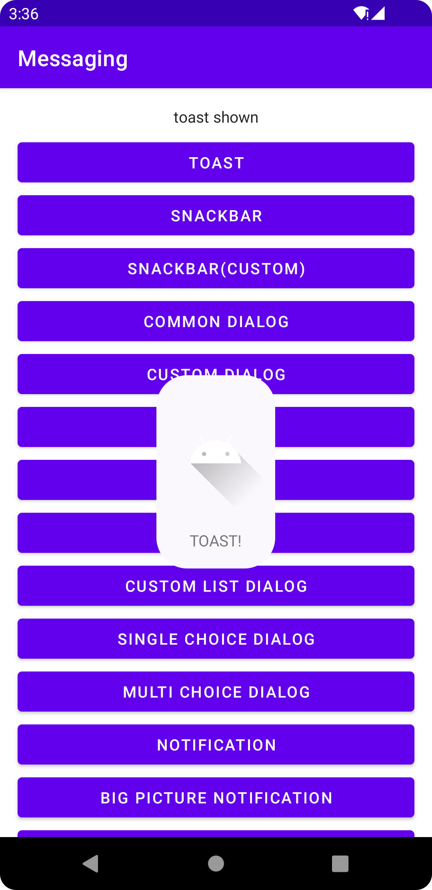
- 스낵바
  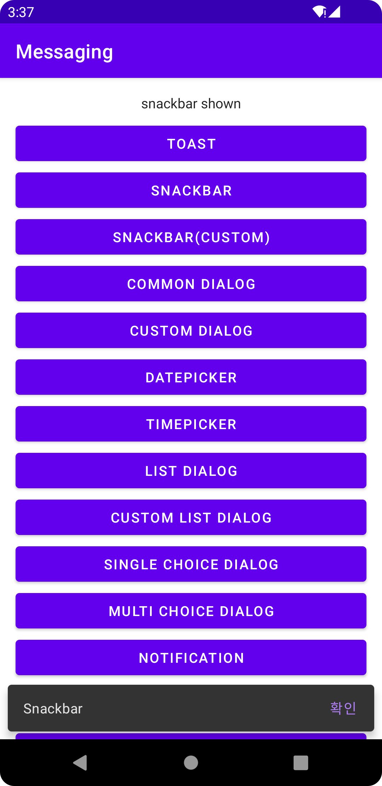
- 커스텀 스낵바
  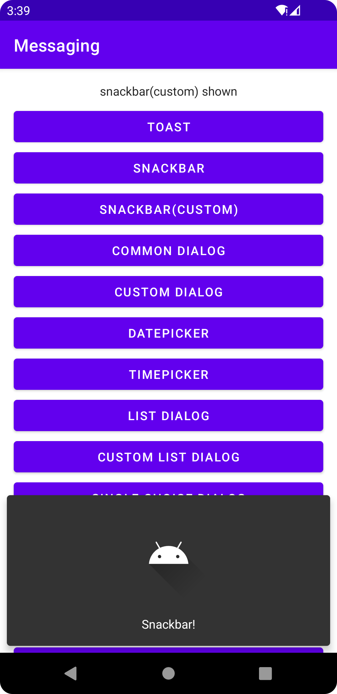
- 다이얼로그
  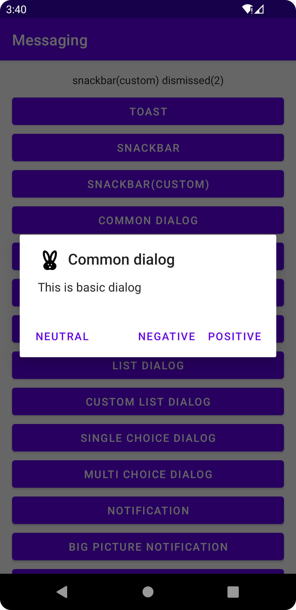
- 커스텀 다이얼로그
  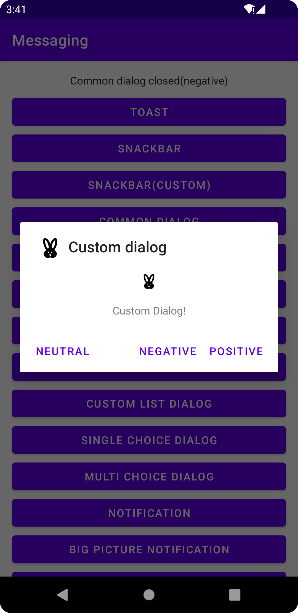
- 데이트 피커
  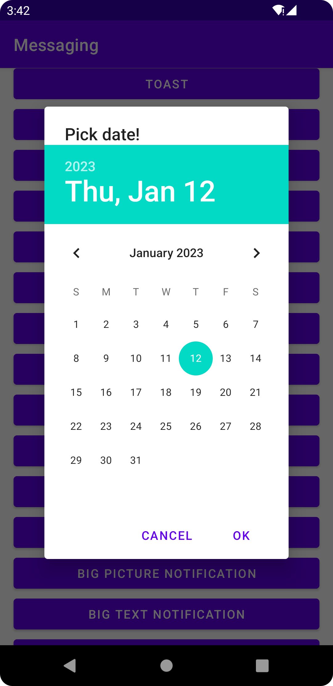
- 타임 피커
  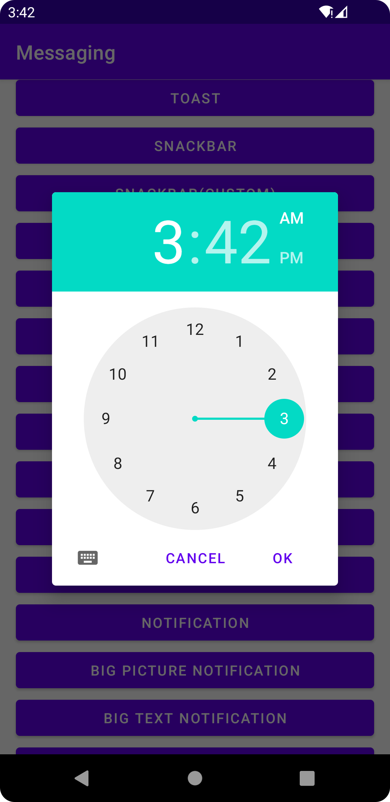
- 리스트 다이얼로그
  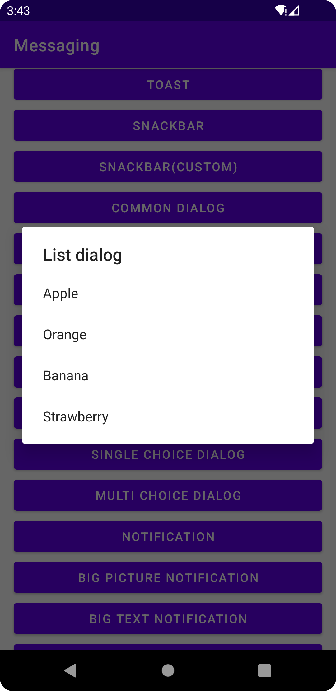
- 커스텀 리스트 다이얼로그
  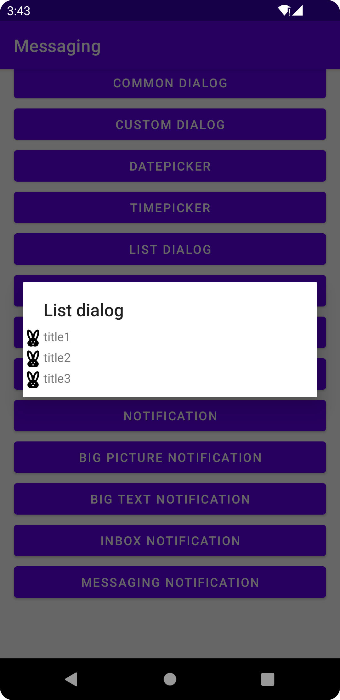
- 단일 선택 다이얼로그
  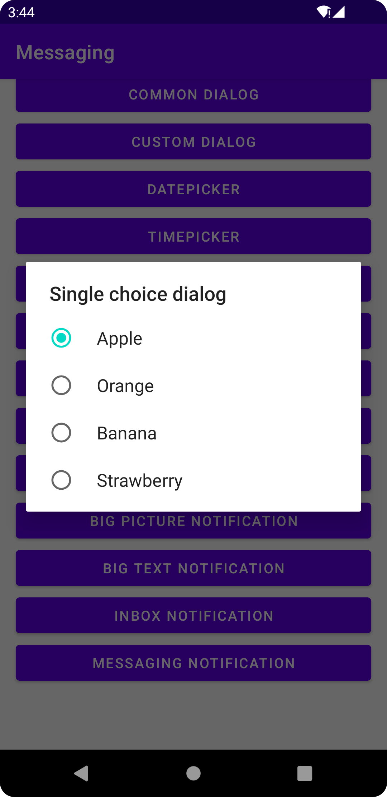
- 복수 선택 다이얼로그
  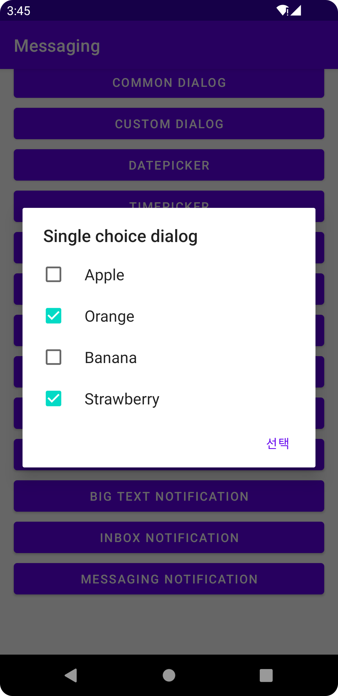
- 알림
  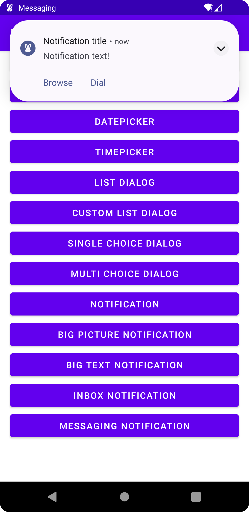
- 빅픽처 알림
  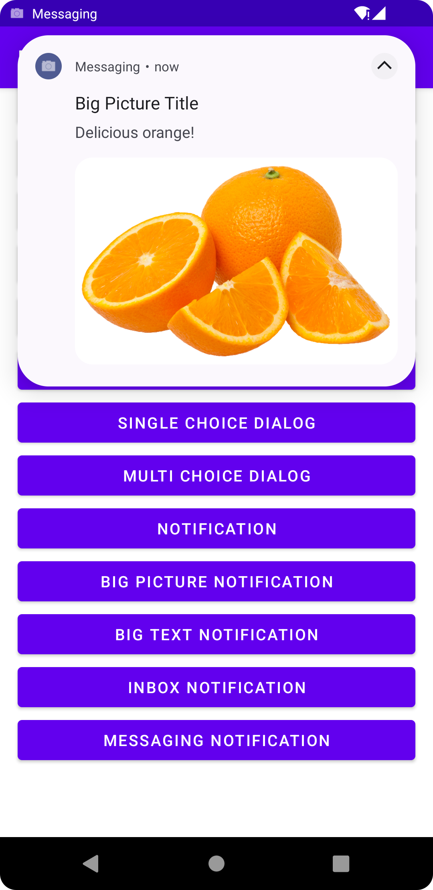
- 빅텍스트 알림
  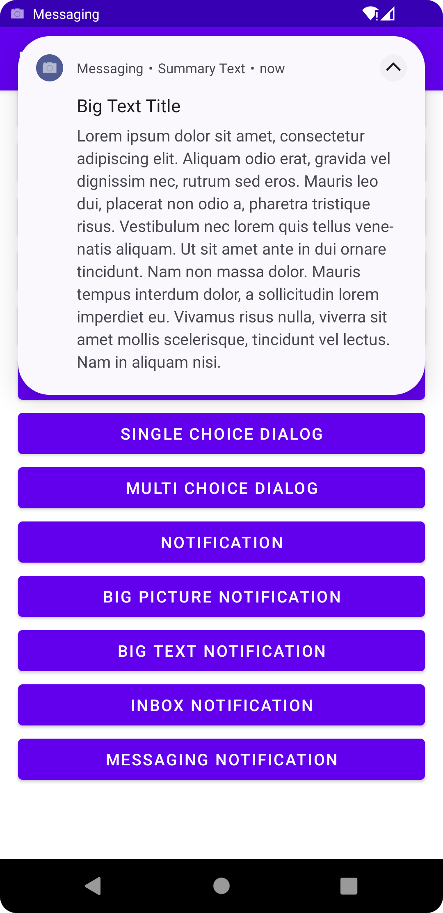
- 인박스 알림
  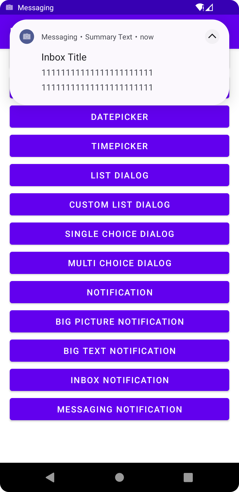
- 메시지 알림
  
